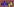

# H2OT3



## Overview

**H2OT3** is an experimental cross‑platform GUI framework written in C.  
Its goal is to provide a **fast**, **secure**, and **simple** foundation for building graphical applications with minimal overhead.

This project is currently a **proof of concept**.  
Many features are incomplete or experimental.

---

## Current Status

H2OT3 is in early development.  
The following limitations currently apply:

- Windows cannot be displayed reliably yet  
- The event system is not implemented  
- Several backends are missing or incomplete  
- API design is still evolving  
- No stable release yet

Despite this, the project already demonstrates the core ideas behind a lightweight, backend‑agnostic GUI layer.

---

## Goals

- **Cross‑platform windowing** (Win32, XCB, Cocoa, …)  
- **Minimal and clean C API**  
- **Fast startup and low overhead**  
- **Secure memory handling**  
- **Backend‑agnostic rendering**  
- **Simple integration into existing C projects**

---

## Planned Features (Roadmap)

- [ ] Basic window creation on all platforms  
- [ ] Event system (keyboard, mouse, resize, focus)  
- [ ] Rendering abstraction  
- [ ] Example applications  
- [ ] Documentation  
- [ ] First stable release (`v0.1.0`)

Another similar roadmap is in ROADMAP.md

---

## Building

```bash
cmake -S . -B build
cmake --build build
```

## Contributing

See CONTRIBUTING.md

## License

See LICENSE.md
